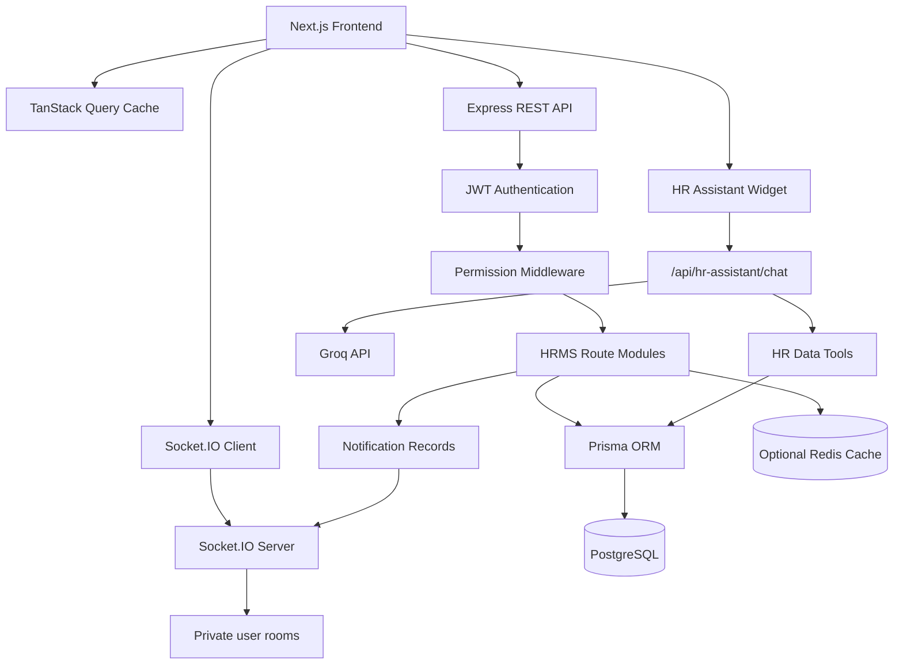

# Chris Tech HRMS — Implementation Plan And Project Status

**Owner:** Chris Tech / Zetu Business Solutions ([www.christech.co.ke](https://www.christech.co.ke))

## 1. Product Goal

Build a full-stack HR Management System where a company can manage employee operations, attendance, leave, payroll, recruitment, performance, notifications, announcements, reports, and employee self-service from one role-based web application.

The current project has moved beyond the original MVP and beyond single-tenant. Recruitment, performance management, real-time notifications, responsive UI improvements, PostgreSQL persistence, and a Groq-powered HR assistant are implemented, and the platform has been migrated to multi-tenant SaaS architecture so multiple companies can each manage isolated HR data inside one deployment. See `MULTI_TENANT_ROADMAP.md` for the full phase-by-phase migration record and `docs/multi-tenant-design.md` for the underlying design decisions.

## 2. Current User Roles

| Role | Responsibility | Access Level |
| --- | --- | --- |
| Platform Owner | Cross-company platform administration (create/suspend companies, view basic usage) — no automatic access to any company's HR data | Platform-level access, deliberately excluded from tenant HR/payroll data |
| Super Admin | Company-wide HRMS access, permissions, and organization-level workflows | Full access within one company |
| HR Admin | Employees, attendance, leave, payroll, recruitment, performance, reports, announcements | HR operations access within one company |
| Manager | Team visibility, leave approvals, performance workflows | Team-level access within one company |
| Employee | Own profile, attendance, leave, payslips, notifications, HR assistant | Self-service access within one company |

## 3. Current Implementation Status

| Area | Status | Notes |
| --- | --- | --- |
| Project foundation | Implemented | npm workspaces, Next.js frontend, Express backend, Prisma, Docker PostgreSQL |
| Authentication | Implemented | Login, register, logout, forgot password, reset password, JWT |
| Authorization | Implemented | Role and permission based middleware plus protected frontend pages |
| Employee management | Implemented | Employees, departments, designations, managers, emergency contacts, document metadata |
| Attendance | Implemented | Clock in/out, work mode, shift settings, holiday management, reports |
| Leave management | Implemented | Leave types, requests, approvals, rejection, balances, notifications |
| Payroll | Implemented | Salary setup, payroll generation, payroll items, payslips, reports |
| Dashboard | Implemented | Role-aware summary cards, recent notifications, announcements, optional cache |
| Reports | Implemented | Employee, attendance, leave, payroll reports |
| Notifications | Implemented | In-app notifications, read state, announcements |
| Real-time updates | Implemented | Socket.IO, JWT socket auth, user rooms, TanStack Query cache sync |
| Recruitment | Implemented | Jobs, candidates, applications, interviews, offers |
| Performance | Implemented | Goals, reviews, feedback, appraisal history |
| HR assistant | Implemented | Groq-backed assistant with HR data tools |
| Responsive UI | Implemented | Mobile navbar/sidebar and page-level responsive fixes |
| Multi-tenant SaaS migration | Implemented (pending live-DB verification) | Company-scoped schema, auth/middleware, all 11 modules, frontend company context, and audit logging for boundary violations — see `MULTI_TENANT_ROADMAP.md` |
| Smoke validation | Implemented | Backend smoke test covers key workflows plus per-module cross-tenant isolation checks |
| Production hardening | Future | CI, deployment, audit logs, email delivery, storage, monitoring |

## 4. Current Tech Stack

| Layer | Tool | Current Use |
| --- | --- | --- |
| Frontend | Next.js 15, React 19, TypeScript | App Router web application |
| Styling | Tailwind CSS | Responsive HR dashboard UI |
| Forms | React Hook Form | Form state and validation flows |
| API state | TanStack Query | Fetching, caching, invalidation, realtime cache updates |
| Icons | Lucide React | UI navigation and actions |
| Backend | Node.js, Express, TypeScript | REST API and Socket.IO server |
| Database | PostgreSQL | Persistent HRMS data |
| ORM | Prisma | Schema, migrations, typed queries |
| Realtime | Socket.IO | User-scoped notification delivery |
| AI | Groq API | HR assistant function/tool orchestration |
| Validation | Zod | Request validation |
| Cache | Redis optional | Dashboard summary caching |
| Local infra | Docker Compose | PostgreSQL container |
| Tooling | npm workspaces, ESLint, TypeScript | Build and validation workflow |

## 5. Current System Architecture



## 6. Request And Event Flows

### Standard API Flow

1. User logs in from the frontend.
2. Backend validates credentials and returns a JWT.
3. Frontend stores the session locally.
4. Protected API requests include `Authorization: Bearer <token>`.
5. Backend authenticates the token.
6. Backend checks required permissions.
7. Route module runs domain logic.
8. Prisma saves or reads data from PostgreSQL.
9. API returns a typed success or failure response.

### Realtime Notification Flow

1. Authenticated frontend opens a Socket.IO connection.
2. Socket handshake sends the current JWT.
3. Backend verifies the token and joins `user:<userId>`.
4. A workflow creates a notification after a committed database transaction.
5. Backend emits `notifications:created` or `notifications:read` to the user's room.
6. Frontend updates TanStack Query caches for notifications and dashboard summary.
7. Browser UI updates without refresh.

### HR Assistant Flow

1. Employee asks a natural language question in the floating chat widget.
2. Frontend posts the message and recent history to `/api/hr-assistant/chat`.
3. Backend sends Groq a system prompt plus HR tool declarations.
4. Groq chooses a tool when factual HR data is needed.
5. Backend executes the selected tool against authenticated employee data.
6. Backend returns the tool result to Groq.
7. Groq writes a concise answer for the employee.

Supported assistant tools:

```text
get_leave_balance
get_next_payroll
get_manager
```

## 7. Implemented Module Details

### Authentication And RBAC

Implemented capabilities:

- Login
- Register
- Logout
- Forgot password
- Reset password
- Current user session
- JWT verification
- Account status checks
- Permission middleware

Primary routes:

```text
POST /api/auth/login
POST /api/auth/register
POST /api/auth/forgot-password
POST /api/auth/reset-password
GET  /api/auth/me
POST /api/auth/logout
```

### Employee Core

Implemented capabilities:

- Employee list, create, detail, update, deactivate
- Department management
- Designation management
- Profile view
- Manager hierarchy
- Emergency contacts
- Employee document metadata

Primary routes:

```text
GET    /api/employees
POST   /api/employees
GET    /api/employees/me
GET    /api/employees/:id
PUT    /api/employees/:id
DELETE /api/employees/:id
GET    /api/departments
POST   /api/departments
GET    /api/designations
POST   /api/designations
POST   /api/employees/:id/documents
```

### Attendance And Time

Implemented capabilities:

- Clock in
- Clock out
- Attendance history
- Attendance report
- Shift setup
- Holiday setup
- Work mode tracking

Primary routes:

```text
POST /api/attendance/clock-in
POST /api/attendance/clock-out
GET  /api/attendance/me
GET  /api/attendance/report
GET  /api/shifts
POST /api/shifts
GET  /api/holidays
POST /api/holidays
```

### Leave Management

Implemented capabilities:

- Leave type setup
- Employee leave request
- Manager/HR approval
- Manager/HR rejection
- Leave balance updates
- Leave history
- Realtime notifications

Primary routes:

```text
POST /api/leaves
GET  /api/leaves
GET  /api/leaves/me
PUT  /api/leaves/:id/approve
PUT  /api/leaves/:id/reject
GET  /api/leaves/balance
GET  /api/leave-types
POST /api/leave-types
```

### Payroll

Implemented capabilities:

- Salary setup
- Salary update
- Monthly payroll generation
- Payroll details
- Payslip records
- Payslip download response
- Realtime payslip notifications

Primary routes:

```text
GET  /api/salaries
POST /api/salaries
PUT  /api/salaries/:id
POST /api/payroll/generate
GET  /api/payroll
GET  /api/payroll/:id
GET  /api/payroll/:id/payslip
GET  /api/payroll/me
```

### Dashboard, Reports, Notifications, And Announcements

Implemented capabilities:

- Role-aware dashboard summary
- Optional Redis cache for dashboard summary
- Employee report
- Attendance report
- Leave report
- Payroll report
- In-app notifications
- Notification read state
- Audience-based announcements
- Realtime notification cache sync

Primary routes:

```text
GET  /api/dashboard/summary
GET  /api/reports/employees
GET  /api/reports/attendance
GET  /api/reports/leaves
GET  /api/reports/payroll
GET  /api/notifications
PUT  /api/notifications/:id/read
GET  /api/announcements
POST /api/announcements
```

### Recruitment

Implemented capabilities:

- Jobs
- Candidates
- Applications
- Interview scheduling
- Interview status updates
- Offers
- Offer status updates
- Realtime interviewer notifications

Primary routes:

```text
GET  /api/jobs
POST /api/jobs
GET  /api/jobs/:id
GET  /api/candidates
POST /api/candidates
GET  /api/candidates/:id
GET  /api/applications
POST /api/applications
PUT  /api/applications/:id/status
GET  /api/interviews
POST /api/interviews
PUT  /api/interviews/:id/status
GET  /api/offers
POST /api/offers
PUT  /api/offers/:id/status
```

### Performance Management

Implemented capabilities:

- Performance employee list
- Goals
- Goal updates
- Reviews
- Review status updates
- Feedback
- Appraisal history UI

Primary routes:

```text
GET  /api/performance/employees
GET  /api/goals
POST /api/goals
PUT  /api/goals/:id
GET  /api/performance-reviews
POST /api/performance-reviews
PUT  /api/performance-reviews/:id/status
GET  /api/feedback
POST /api/feedback
```

### HR Assistant

Implemented capabilities:

- Floating chat widget
- Groq model request
- HR tool declarations
- Tool execution against authenticated employee data
- Short natural language responses

Primary route:

```text
POST /api/hr-assistant/chat
```

## 8. Current Database Entities

```text
User
Role
Permission
UserRole
RolePermission
PasswordResetToken
Employee
Department
Designation
EmergencyContact
EmployeeDocument
Attendance
Shift
Holiday
LeaveType
LeaveRequest
LeaveBalance
Salary
Payroll
PayrollItem
Payslip
Notification
Announcement
Job
Candidate
JobApplication
Interview
Offer
Goal
PerformanceReview
Feedback
```

## 9. Validation Strategy

Current commands:

```bash
npm run typecheck
npm run lint
npm run build
npm run test:smoke
npm run verify
```

Current smoke test coverage:

- Health endpoint and database connection
- Authentication and unauthenticated rejection
- Employee RBAC checks
- Employee detail and document metadata
- Attendance clock-in and clock-out
- Leave request, approval, and balance update
- Salary update and payroll generation
- Payslip response
- Dashboard, notifications, announcements, and reports
- Password reset development response
- Recruitment and performance endpoint availability
- Validation error behavior

## 10. Current Demo Flow

```text
Admin logs in
-> Admin reviews dashboard
-> Admin manages employees, departments, and designations
-> Employee logs in and marks attendance
-> Employee applies for leave
-> Manager or HR approves/rejects leave
-> Employee receives realtime notification
-> HR generates payroll
-> Employee receives realtime payslip notification
-> HR schedules interview
-> Interviewer receives realtime interview notification
-> Employee asks HR assistant about leave, payroll, or manager
```

## 11. Portfolio Highlights

This project now demonstrates:

- End-to-end TypeScript full-stack development
- PostgreSQL relational modeling with Prisma
- Role and permission based product workflows
- Real-time event delivery with Socket.IO
- LLM orchestration with Groq tool use
- TanStack Query cache synchronization
- Responsive operational UI design
- API validation with Zod
- Smoke testing of real backend flows

## 12. Remaining Roadmap

### Production Readiness

- Add hosted demo and production deployment configuration
- Add CI for typecheck, lint, build, and smoke tests
- Add structured audit logs for HR, payroll, auth, and permission-sensitive actions
- Add API rate limiting and request logging for production
- Add observability: health checks, metrics, error tracking

### Notifications And Communication

- Add production email delivery for password reset, leave, payroll, interviews, and announcements
- Add notification preferences by user
- Add Socket.IO Redis adapter for multi-instance scaling

### Files And Documents

- Add S3, Cloudinary, or equivalent storage for employee documents
- Add secure file download URLs
- Add generated PDF payslips and offer letters

### Reporting And Analytics

- Add charts to reports and dashboard
- Add CSV/PDF export for HR reports
- Add advanced filters and saved report views

### Security And Compliance

- Add stronger password policy controls
- Add account lockout or throttling
- Add audit trails for employee, payroll, and permission changes
- Review PII handling before any production deployment

### Testing

- Add integration tests for Socket.IO notification delivery
- Add HR assistant tests using deterministic tool execution
- Add browser smoke tests for the most important user workflows

## 13. Build Priority From Here

Recommended next order:

1. Production email delivery
2. File storage for employee documents
3. Audit logs
4. CI workflow
5. Report charts and exports
6. Socket.IO Redis adapter
7. Deployment

This order improves real-world readiness without disrupting the implemented HRMS feature set.