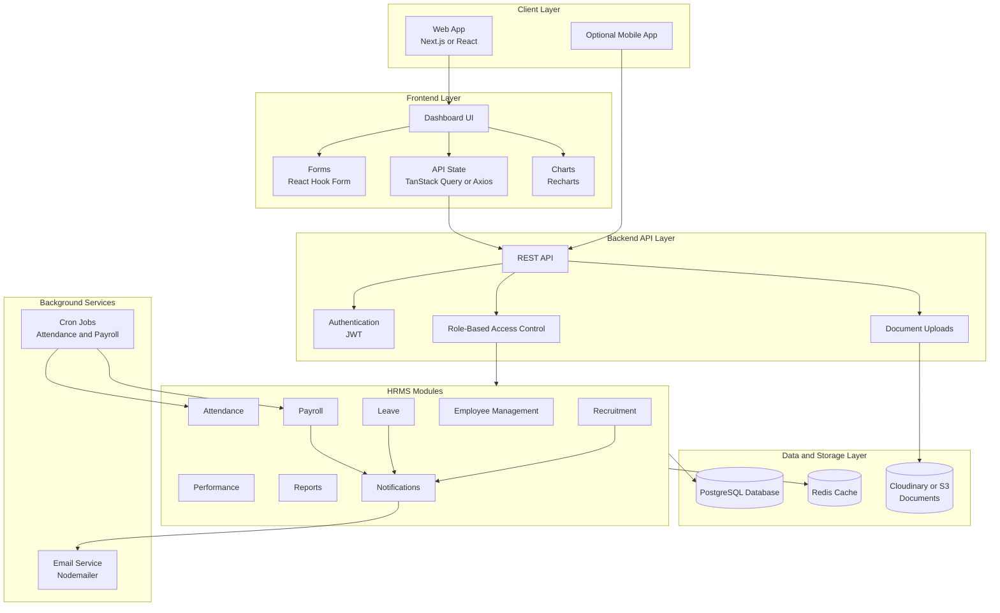

# HR Management System Plan

## 1. Goal

Build one web application where a company can manage HR work in one place.

The system should help with:

- Employee records
- Attendance
- Leave requests
- Payroll
- Recruitment
- Performance reviews
- Company announcements
- Dashboards and reports

## 2. Main Users

| Role | What This User Does | Access Level |
| --- | --- | --- |
| Super Admin | Manages company settings, HR users, roles, and permissions | Full access |
| HR Admin | Manages employees, attendance, leave, payroll, documents, and recruitment | HR access |
| Manager | Manages team members, leave approvals, and performance reviews | Team access |
| Employee | Views profile, marks attendance, applies for leave, uploads documents, and views payslips | Own data only |

## 3. Recommended Tech Stack

Use this stack if you want a clean and practical full-stack project.

| Layer | Recommended Tools | Purpose |
| --- | --- | --- |
| Frontend | Next.js, Tailwind CSS | Build the web dashboard and pages |
| Forms | React Hook Form | Handle forms and validation |
| API Calls | TanStack Query or Axios | Call backend APIs from the frontend |
| Charts | Recharts | Show dashboard charts and reports |
| Backend | Node.js with Express.js or NestJS | Build the API server |
| Auth | JWT authentication | Secure login and protected routes |
| Permissions | Role-based access control | Control what each role can do |
| Database | PostgreSQL | Store company and HR data |
| ORM | Prisma | Work with the database using models |
| Cache | Redis | Cache data or manage sessions if needed |
| File Storage | Cloudinary or S3 | Store employee documents |
| Email | Nodemailer | Send emails and notifications |
| Jobs | Cron jobs | Run scheduled attendance and payroll tasks |

## 4. Deployment Plan

| Part | Good Options |
| --- | --- |
| Frontend | Vercel or Netlify |
| Backend | Render, Railway, AWS, or DigitalOcean |
| Database | Supabase, Neon, RDS, or Railway PostgreSQL |
| File Storage | Cloudinary or S3 |

## 5. System Architecture



## 6. How The System Works

1. A user opens the web app and logs in.
2. The backend verifies the login and returns a JWT token.
3. The frontend sends that token with future API requests.
4. The backend checks the user's role before allowing any action.
5. HR modules save and read data from PostgreSQL.
6. Uploaded documents are stored in Cloudinary or S3.
7. Cron jobs run automatic tasks like payroll generation and attendance checks.
8. Notifications are sent inside the app or by email.

## 7. Core Modules

### Module 1: Authentication And Authorization

Purpose: control login, users, roles, and permissions.

Features:

- Login
- Register users
- Forgot password
- Reset password
- JWT authentication
- Role-based permissions
- Account status: active, inactive, terminated

Database tables:

- users
- roles
- permissions
- user_roles

Important routes:

```text
POST /api/auth/login
POST /api/auth/register
POST /api/auth/forgot-password
POST /api/auth/reset-password
GET  /api/auth/me
```

### Module 2: Employee Management

Purpose: store and manage employee information.

Features:

- Add employees
- Edit employees
- Delete employees
- View employee profile
- Assign department
- Assign designation
- Track employment status
- Store emergency contacts
- Upload employee documents

Database tables:

- employees
- departments
- designations
- employee_documents
- emergency_contacts

Important routes:

```text
GET    /api/employees
POST   /api/employees
GET    /api/employees/:id
PUT    /api/employees/:id
DELETE /api/employees/:id
```

### Module 3: Attendance Management

Purpose: track daily work attendance.

Features:

- Clock in
- Clock out
- Daily attendance records
- Late marks
- Work-from-home status
- Monthly attendance reports

Database tables:

- attendance
- shifts
- holidays

Important routes:

```text
POST /api/attendance/clock-in
POST /api/attendance/clock-out
GET  /api/attendance/me
GET  /api/attendance/report
```

### Module 4: Leave Management

Purpose: manage employee leave requests and balances.

Features:

- Apply for leave
- Approve leave
- Reject leave
- Track leave balance
- View leave history
- Manage holiday calendar

Database tables:

- leave_types
- leave_requests
- leave_balances
- holidays

Important routes:

```text
POST /api/leaves
GET  /api/leaves
PUT  /api/leaves/:id/approve
PUT  /api/leaves/:id/reject
GET  /api/leaves/balance
```

### Module 5: Payroll Management

Purpose: calculate salary and generate payslips.

Features:

- Salary setup
- Allowances
- Deductions
- Monthly payroll generation
- Bonus and incentives
- Payslip download

Database tables:

- salaries
- payrolls
- payroll_items
- payslips

Important routes:

```text
POST /api/payroll/generate
GET  /api/payroll
GET  /api/payroll/:id/payslip
```

### Module 6: Recruitment

Purpose: manage hiring from job posting to offer letter.

Features:

- Create job posts
- Store candidate applications
- Schedule interviews
- Track candidate status
- Generate offer letters

Database tables:

- jobs
- candidates
- applications
- interviews
- offers

Important routes:

```text
POST /api/jobs
GET  /api/jobs
POST /api/candidates
PUT  /api/applications/:id/status
```

### Module 7: Performance Management

Purpose: track goals, reviews, ratings, and feedback.

Features:

- Employee goals
- Manager reviews
- Ratings
- Feedback
- Appraisal history

Database tables:

- performance_reviews
- goals
- feedback

### Module 8: Announcements And Notifications

Purpose: send updates to employees and HR users.

Features:

- Company announcements
- Email alerts
- In-app notifications
- Leave approval notifications
- Payroll notifications

Database tables:

- announcements
- notifications

### Module 9: Reports And Dashboard

Purpose: give HR and admins a quick view of company activity.

Dashboard cards:

- Total employees
- Present employees today
- Employees on leave
- Pending leave requests
- Monthly payroll cost
- New hires
- Attrition rate

Reports:

- Employee report
- Attendance report
- Leave report
- Payroll report
- Recruitment report

## 8. Main Database Entities

```text
User
Role
Permission
Employee
Department
Designation
Attendance
Shift
Holiday
LeaveRequest
LeaveType
LeaveBalance
Payroll
Salary
Payslip
Document
Job
Candidate
Application
Interview
Offer
PerformanceReview
Goal
Feedback
Notification
Announcement
```

## 9. Suggested Build Order

Build the system in phases so the project stays manageable.

| Phase | Focus | What To Build |
| --- | --- | --- |
| Phase 1 | Foundation | Project setup, database setup, authentication, roles, base dashboard layout |
| Phase 2 | Employee Core | Employee CRUD, departments, designations, document upload |
| Phase 3 | Attendance And Leave | Clock in, clock out, attendance reports, leave requests, leave approval |
| Phase 4 | Payroll | Salary setup, payroll generation, payslip download |
| Phase 5 | Recruitment And Performance | Job posts, candidates, interviews, performance reviews |
| Phase 6 | Reports And Polish | Dashboards, charts, reports, notifications, testing, deployment |

## 10. MVP Version

Start with only the most important features.

MVP features:

1. Login and authentication
2. Role management
3. Employee management
4. Department and designation management
5. Attendance clock in and clock out
6. Leave request and approval
7. Basic payroll
8. Basic dashboard

Build later:

- Recruitment
- Performance reviews
- Advanced reports
- Automated payroll
- Advanced notifications
- Mobile app

## 11. Simple User Flow

```text
Employee logs in
-> Employee marks attendance
-> Employee applies for leave
-> Manager approves or rejects leave
-> HR reviews attendance and leave data
-> HR generates monthly payroll
-> Employee downloads payslip
```

## 12. What To Build First

The best first version should include:

1. Database schema with users, roles, employees, attendance, leave, and payroll tables.
2. Backend APIs for auth, employees, attendance, leave, and payroll.
3. Frontend pages for login, dashboard, employees, attendance, leave, and payroll.
4. Role-based access so each user only sees allowed pages and actions.
5. Basic reports for employee count, attendance summary, leave summary, and payroll summary.
