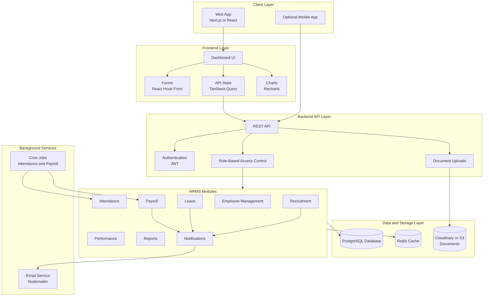

# HR Management System Phase Plan

## 1. Product Goal

Build a full-stack HR Management System where a company can manage employees, attendance, leave, payroll, recruitment, performance, notifications, and reports from one web application.

The system should support four main user types:

| Role | Main Responsibility | Access Level |
| --- | --- | --- |
| Super Admin | Company settings, HR users, roles, and permissions | Full system access |
| HR Admin | Employees, attendance, leave, payroll, documents, and recruitment | HR operations access |
| Manager | Team members, leave approvals, and performance reviews | Team-level access |
| Employee | Own profile, attendance, leave, documents, and payslips | Self-service access |

## 2. Final Product Scope

| Module | Purpose | MVP? |
| --- | --- | --- |
| Authentication and Authorization | Login, users, roles, and permissions | Yes |
| Employee Management | Employee records, departments, designations, documents | Yes |
| Attendance Management | Clock in, clock out, attendance history, reports | Yes |
| Leave Management | Leave requests, approvals, balances, holidays | Yes |
| Payroll Management | Salary setup, payroll generation, payslips | Basic version |
| Dashboard and Reports | HR metrics, charts, summaries, exports | Basic version |
| Notifications | In-app and email alerts | Basic version |
| Recruitment | Jobs, candidates, interviews, offers | Later |
| Performance Management | Goals, reviews, ratings, feedback | Later |

## 3. Recommended Tech Stack

| Layer | Recommended Tool | Why |
| --- | --- | --- |
| Frontend | Next.js | React-based app with routing and production deployment support |
| Styling | Tailwind CSS | Fast, consistent UI styling |
| Forms | React Hook Form | Clean form state and validation handling |
| API State | TanStack Query | API fetching, caching, loading states, and refetching |
| Charts | Recharts | Dashboard charts and reports |
| Backend | Node.js with Express.js or NestJS | REST API for HRMS modules |
| Authentication | JWT | Secure API access after login |
| Authorization | Role-based access control | Restrict pages and actions by user role |
| Database | PostgreSQL | Reliable relational database for HR data |
| ORM | Prisma | Type-safe database models and migrations |
| Cache | Redis | Optional caching, sessions, and rate limiting |
| File Storage | Cloudinary or S3 | Store employee documents and generated files |
| Email | Nodemailer | Send leave, payroll, and account notifications |
| Background Jobs | Cron jobs | Scheduled attendance, leave, and payroll tasks |

## 4. Deployment Plan

| Part | Good Options |
| --- | --- |
| Frontend | Vercel or Netlify |
| Backend | Render, Railway, AWS, or DigitalOcean |
| Database | Supabase, Neon, RDS, or Railway PostgreSQL |
| File Storage | Cloudinary or S3 |

## 5. System Architecture



## 6. Request Flow

1. User logs in from the frontend.
2. Backend validates credentials.
3. Backend returns a JWT token.
4. Frontend sends the token with protected API requests.
5. Backend checks the user's role and permissions.
6. Backend runs the requested module logic.
7. Data is saved in PostgreSQL.
8. Documents are uploaded to Cloudinary or S3.
9. Notifications are sent through in-app alerts or email.
10. Cron jobs run scheduled tasks like payroll and attendance processing.

## 7. Phase-Based Development Plan

### Phase 0: Requirements And Project Decisions

Goal: finalize the project direction before coding starts.

Build or decide:

- Final tech stack
- User roles
- Permission rules
- MVP scope
- Database provider
- Deployment provider
- File storage provider
- Email provider

Deliverables:

- Finalized feature list
- Permission matrix
- Basic database relationship plan
- Confirmed project folder structure

Done when:

- The team knows exactly what the MVP includes.
- The stack is fixed.
- The first database schema can be created.

### Phase 1: Project Foundation

Goal: create the base frontend, backend, database, and developer setup.

Build:

- Frontend project
- Backend project
- PostgreSQL connection
- Prisma setup
- Environment variable setup
- Base dashboard layout
- Common UI layout with sidebar, header, and content area
- Error handling pattern
- API response format

Main database tables:

- users
- roles
- permissions
- user_roles

Main API routes:

```text
GET /api/health
GET /api/auth/me
```

Frontend pages:

- Login page
- Base dashboard page
- Not authorized page

Done when:

- Frontend runs locally.
- Backend runs locally.
- Database connection works.
- A basic dashboard shell is visible after login.

### Phase 2: Authentication And Role-Based Access

Goal: make the system secure and role-aware.

Build:

- Login
- Register or create user
- Forgot password
- Reset password
- JWT authentication
- Password hashing
- Protected API routes
- Protected frontend pages
- Role-based page access
- Account status: active, inactive, terminated

Main database tables:

- users
- roles
- permissions
- user_roles
- password_reset_tokens

Main API routes:

```text
POST /api/auth/login
POST /api/auth/register
POST /api/auth/forgot-password
POST /api/auth/reset-password
GET  /api/auth/me
POST /api/auth/logout
```

Frontend pages:

- Login
- Forgot password
- Reset password
- User profile

Done when:

- Users can log in and log out.
- Unauthorized users cannot access protected pages.
- Each role sees only allowed menu items and actions.

### Phase 3: Employee Core

Goal: build the main employee management workflow.

Build:

- Employee list
- Add employee
- Edit employee
- Delete or deactivate employee
- Employee profile
- Departments
- Designations
- Employment status
- Emergency contacts
- Employee documents
- Document upload

Main database tables:

- employees
- departments
- designations
- employee_documents
- emergency_contacts

Main API routes:

```text
GET    /api/employees
POST   /api/employees
GET    /api/employees/:id
PUT    /api/employees/:id
DELETE /api/employees/:id
GET    /api/departments
POST   /api/departments
GET    /api/designations
POST   /api/designations
POST   /api/employees/:id/documents
```

Frontend pages:

- Employees list
- Add employee
- Edit employee
- Employee profile
- Departments
- Designations

Done when:

- HR can manage employee records from the UI.
- Employees can view their own profile.
- Documents can be uploaded and linked to employee records.

### Phase 4: Attendance Management

Goal: track daily attendance and provide attendance reports.

Build:

- Clock in
- Clock out
- Daily attendance records
- Late mark logic
- Work-from-home status
- Shift setup
- Holiday setup
- Attendance report

Main database tables:

- attendance
- shifts
- holidays

Main API routes:

```text
POST /api/attendance/clock-in
POST /api/attendance/clock-out
GET  /api/attendance/me
GET  /api/attendance/report
GET  /api/shifts
POST /api/shifts
GET  /api/holidays
POST /api/holidays
```

Frontend pages:

- My attendance
- Attendance report
- Shift settings
- Holiday calendar

Done when:

- Employees can clock in and clock out.
- HR can view attendance reports.
- Attendance data can be filtered by employee, date, and department.

### Phase 5: Leave Management

Goal: allow employees to request leave and managers or HR to approve it.

Build:

- Leave types
- Leave request form
- Leave approval workflow
- Leave rejection workflow
- Leave balance tracking
- Leave history
- Holiday calendar integration
- Leave notifications

Main database tables:

- leave_types
- leave_requests
- leave_balances
- holidays
- notifications

Main API routes:

```text
POST /api/leaves
GET  /api/leaves
GET  /api/leaves/me
PUT  /api/leaves/:id/approve
PUT  /api/leaves/:id/reject
GET  /api/leaves/balance
GET  /api/leave-types
POST /api/leave-types
```

Frontend pages:

- Apply leave
- My leave history
- Leave approvals
- Leave balances
- Leave settings

Done when:

- Employees can apply for leave.
- Managers or HR can approve or reject leave.
- Leave balances update correctly.

### Phase 6: Basic Payroll

Goal: generate simple monthly payroll and payslips.

Build:

- Salary setup
- Allowances
- Deductions
- Monthly payroll generation
- Payroll review
- Payslip generation
- Payslip download
- Payroll notifications

Main database tables:

- salaries
- payrolls
- payroll_items
- payslips

Main API routes:

```text
POST /api/payroll/generate
GET  /api/payroll
GET  /api/payroll/:id
GET  /api/payroll/:id/payslip
GET  /api/salaries
POST /api/salaries
PUT  /api/salaries/:id
```

Frontend pages:

- Salary setup
- Payroll list
- Payroll detail
- My payslips

Done when:

- HR can create salary structures.
- HR can generate monthly payroll.
- Employees can download payslips.

### Phase 7: Dashboard, Reports, And Notifications

Goal: give users clear summaries and alerts.

Build:

- Admin dashboard
- HR dashboard
- Manager dashboard
- Employee dashboard
- Employee report
- Attendance report
- Leave report
- Payroll report
- In-app notifications
- Email notifications

Dashboard cards:

- Total employees
- Present employees today
- Employees on leave
- Pending leave requests
- Monthly payroll cost
- New hires
- Attrition rate

Main database tables:

- notifications
- announcements

Main API routes:

```text
GET  /api/dashboard/summary
GET  /api/reports/employees
GET  /api/reports/attendance
GET  /api/reports/leaves
GET  /api/reports/payroll
GET  /api/notifications
PUT  /api/notifications/:id/read
POST /api/announcements
GET  /api/announcements
```

Frontend pages:

- Dashboard
- Reports
- Notifications
- Announcements

Done when:

- Each role has a useful dashboard.
- HR can view core reports.
- Users receive important notifications.

### Phase 8: Recruitment

Goal: manage hiring from job post to offer.

Build:

- Job posts
- Candidate applications
- Candidate profiles
- Interview scheduling
- Candidate status tracking
- Offer letters

Main database tables:

- jobs
- candidates
- applications
- interviews
- offers

Main API routes:

```text
POST /api/jobs
GET  /api/jobs
GET  /api/jobs/:id
POST /api/candidates
GET  /api/candidates
POST /api/interviews
PUT  /api/applications/:id/status
POST /api/offers
```

Frontend pages:

- Jobs
- Candidates
- Candidate profile
- Interviews
- Offers

Done when:

- HR can publish jobs.
- HR can manage candidates.
- HR can track interview and offer status.

### Phase 9: Performance Management

Goal: support employee goals, feedback, reviews, and appraisals.

Build:

- Employee goals
- Manager reviews
- Ratings
- Feedback
- Appraisal history

Main database tables:

- goals
- performance_reviews
- feedback

Main API routes:

```text
GET  /api/goals
POST /api/goals
PUT  /api/goals/:id
GET  /api/performance-reviews
POST /api/performance-reviews
POST /api/feedback
GET  /api/feedback
```

Frontend pages:

- Goals
- Performance reviews
- Feedback
- Appraisal history

Done when:

- Employees and managers can track goals.
- Managers can submit reviews.
- HR can view performance history.

### Phase 10: Testing, Polish, And Deployment

Goal: prepare the system for real use.

Build:

- Form validation improvements
- Loading and empty states
- Error states
- Responsive UI
- API validation
- Unit tests
- Integration tests
- Permission tests
- Deployment configuration
- Production environment variables
- Database migration process

Testing checklist:

- Authentication works.
- Role permissions work.
- Employee CRUD works.
- Attendance rules work.
- Leave balances update correctly.
- Payroll calculation is correct.
- Reports show correct data.
- Uploaded documents open correctly.
- Emails are sent correctly.

Done when:

- The app is deployed.
- Core workflows work in production.
- The MVP is ready for real users.

## 8. MVP Build Plan

The MVP should stop after Phase 7.

MVP includes:

1. Project foundation
2. Authentication
3. Role-based access
4. Employee management
5. Attendance
6. Leave management
7. Basic payroll
8. Dashboard
9. Basic reports
10. Notifications

MVP does not include:

- Recruitment
- Performance management
- Advanced payroll automation
- Mobile app
- Advanced analytics

## 9. Simple User Flow

```text
Employee logs in
-> Employee marks attendance
-> Employee applies for leave
-> Manager approves or rejects leave
-> HR reviews attendance and leave data
-> HR generates monthly payroll
-> Employee downloads payslip
```

## 10. Main Database Entities

```text
User
Role
Permission
Employee
Department
Designation
Attendance
Shift
Holiday
LeaveRequest
LeaveType
LeaveBalance
Payroll
Salary
Payslip
Document
Job
Candidate
Application
Interview
Offer
PerformanceReview
Goal
Feedback
Notification
Announcement
```

## 11. Build Priority

Build in this order:

1. Authentication and roles
2. Employee management
3. Attendance
4. Leave management
5. Basic payroll
6. Dashboard and reports
7. Notifications
8. Recruitment
9. Performance management
10. Deployment and polish

This order gives a usable HRMS early, then adds advanced features later.
